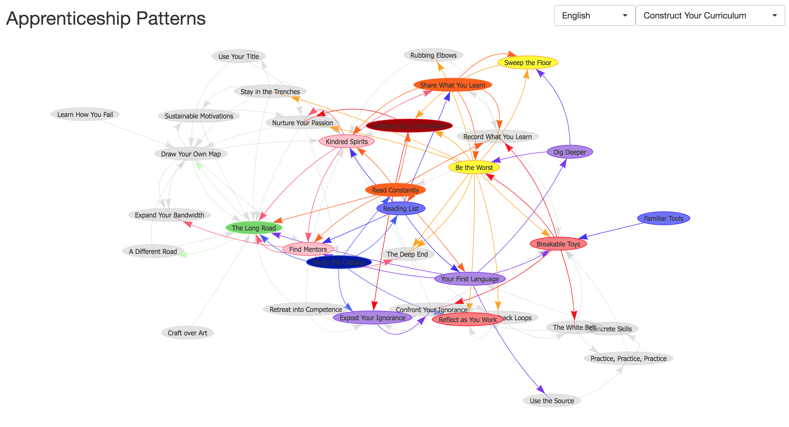

# The visualization network for Apprenticeship Patterns using Vis.js

**Website available at:** [Apprenticeship Patterns Visualization](https://cyyeh.github.io/apprenticeship_patterns/)

The visualization network for pattern relationship in one of software engineering classic, [Apprenticeship Patterns](https://www.amazon.com/Apprenticeship-Patterns-Guidance-Aspiring-Craftsman/dp/0596518382).

Done
- [x] showing relationship among different patterns and groups
- [x] English and Traditional Chinese available

Todo
- [ ] More concrete message explaining details of each pattern
